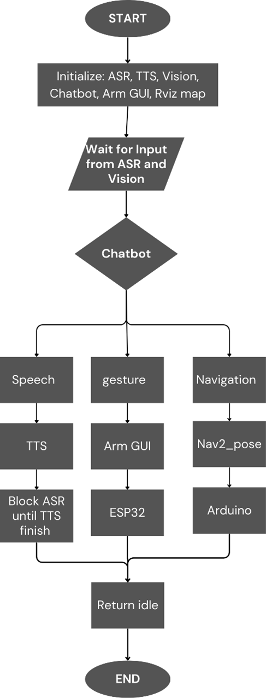

# 🔧 Project Overview – My Role

This project is about developing a humanoid robot that can move its arms, talk to people, and navigate through a mapped area. My part focused mainly on integrating and controlling the **robotic arms** and the **chatbot system**.

I handled:

* 🦾 **Arm control** using an ESP32 and servo motors via ROS 2
* 🖥️ **GUI development** to control the arms manually
* 💬 **Chatbot integration** using **ASR (Speech-to-Text)**, **Mistral AI for responses**, and **TTS (Text-to-Speech)**
* 🧠 Making sure all components run smoothly together, including launching scripts and fixing audio issues

The goal was to let users control the robot using natural language and see the robot respond through movement and speech. The system runs on a Jetson Orin Nano and uses Python + ROS 2 to connect everything together.

---

# 🔄 How the System Works

<p align="center">
  
</p>


The robot operates as a modular system where each part (arms, chatbot, navigation) runs independently but communicates through ROS 2. Here's a breakdown of the process:

### 🟢 Startup & Initialization

When the robot starts, it launches all core modules:

* **ASR** for speech input
* **TTS** for speech output
* **Gesture recognition** using MediaPipe
* **Chatbot** using the Mistral API
* **Arm GUI** for gesture testing and control
* **RViz** for navigation visualization

Each module runs separately, and coordination is managed by the chatbot logic + ROS 2.


### 👂 Listening for Input

The system listens to:

* 🎙️ Microphone input → sent to ASR
* 📷 Camera input → sent to gesture recognizer

It can detect both voice and gesture input at the same time.


### 🧠 Chatbot Processing

Once an input is detected (voice or gesture), it's sent to the **Chatbot Operator System**, which uses the **Mistral API** to generate a structured response.

This response may include:

* `talk:` → What to say (TTS)
* `action:` → What gesture to perform (arm movement)
* `nav2_pose:` → Where to go (coordinates for navigation)


### 🔊 Speech Output (TTS Path)

If a `talk:` field is returned:

* The message is spoken using TTS.
* ASR is paused while TTS is speaking to avoid self-feedback.
* Once done, ASR is resumed.

### 🦾 Gesture Execution (Arm Control Path)

If an `action:` is returned:

* The command is sent to the GUI + ESP32 controller.
* The ESP32 uses a PCA9685 PWM driver to move servo motors based on the selected gesture.


### 🧭 Navigation Execution (Nav2 Path)

If `nav2_pose:` is returned:

* The robot sends the coordinates as a ROS 2 goal.
* The Arduino and motors handle actual movement.


### 💤 Return to Idle

After completing a speech, gesture, or navigation task:

* The robot returns to the idle state, waiting for the next input.
* No manual reset is needed.


### ♻️ Modular and Expandable

The system is designed in a loop with modular components. You can:

* Add new gestures, TTS responses, or navigation goals
* Modify chatbot prompts
* Expand action types without touching the main logic


For more information read:
[📄 ELA 2.0 System Implementation Report](Additional/ELA%202.0%20System%20implementation.pdf)


---


# 🤖 How to Run the System

This project controls a humanoid robot with a working arm system, a chatbot (using speech-to-text and text-to-speech), and autonomous navigation. Below are the steps to launch each part of the system.


## 1) 🦾 Arm Control (ESP32 + GUI)

You’ll run this in **one terminal**:

```bash
cd ros2_ws_arms
. install/setup.bash
ros2 run esp32_controller esp32_control_node
```

This sets up your ROS 2 workspace and starts the ESP32 node, which listens for joint angle commands and moves the motors accordingly.

*The file `ESP32_Code.ino` contains the firmware that runs on the ESP32 microcontroller. It listens for commands from the ROS node and moves the servo motors accordingly.*

Then in a **new terminal**, run:

```bash
python3 /home/ela2/ros2_ws_arms/src/GUI/GUI.py
```

This opens the GUI you made to control each joint of the robotic arm manually. You can input joint angles or select predefined gestures.

(Optional) If you want to visualize the arms in RViz:

```bash
ros2 launch ela2_arms display.launch.py
```

This launches RViz with your robot model and controllers, just for visualization/debugging.

---

### 2) 🗣️ Chatbot System (ASR + NLP + TTS)

Before launching the chatbot, you should set the default audio sink (speaker):

```bash
./set-default-sink.sh
```

This script sets your USB speaker as the default output. It waits 5 seconds before setting the sink to make sure PulseAudio is ready. It also unmutes the speaker and sets the volume to 100%. It does **not** handle the microphone.

To launch the full chatbot system:

```bash
./run_tmux_chatbot.sh
```

This script uses `tmux` to run multiple components in parallel:

* `ela2_ears.py`: Handles ASR (Speech-to-Text)
* `Chatbot.py`: Handles text-based interaction using Mistral AI
* `ela2_mouth.py`: Handles TTS (Text-to-Speech)
* `set-default-sink.sh`: Re-applies audio settings if needed

`tmux` automatically splits the terminal into panes and runs everything neatly. You can stop it any time with `Ctrl+B` then `D` to detach or `exit` in each pane.

---

### 🧭 3) Navigation System (LiDAR + Map + RViz)

First, fix the timestamp issue with the `/scan` topic:

```bash
python3 /home/ela2/ELA2.0_NAV/src/ydlidar_ros2_driver/launch/fix_scan_timestamp.py
```

This runs a custom node that republishes the `/scan` data to a new topic (`/scan_fixed`) with corrected timestamps. This fixes sync issues in AMCL or SLAM due to incorrect timestamps.

Then launch the full navigation stack:

```bash
ros2 launch ela2_nav ela2_nav.launch.xml bringup:=true display:=true pre_map:=true map:=apcore
```

This command brings up:

* The robot model in RViz
* LiDAR-based localization (AMCL)
* Navigation2 stack using the preloaded `apcore` map
 
### More on Navigation

Navigation is developed by my teammate. For more details, refer to:
[ELA2.0\_NAV GitHub Repository](https://github.com/LimJingXiang1226/ELA2.0_NAV?tab=readme-ov-file)
